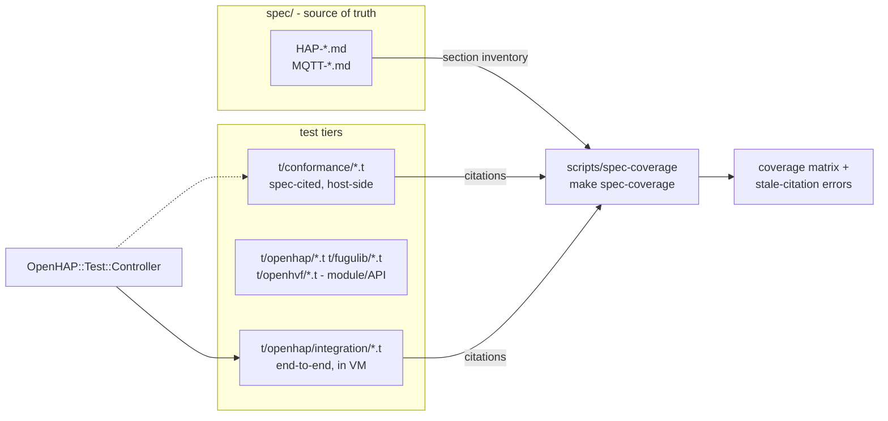
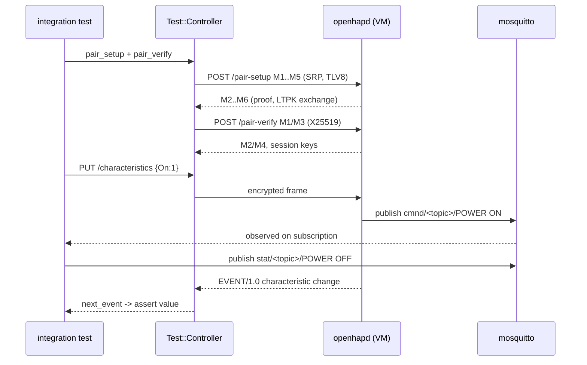

# Test Suite Restructure — Design

## Problem

The primary goal of the test suite is to verify adherence to, and completeness
against, the protocol references in `spec/`. Today the suite is organized purely
by module (mirroring `lib/`), while the specs are organized by protocol topic
with stable `§N.M` section anchors. Exactly one test file cites a spec section;
the rest reference ephemeral audit scratchpads or nothing. There is no way to
answer "is `HAP-Pairing.md §7.4` tested?" mechanically. In addition:

- Crypto tests are self-consistency round-trips with no known-answer vectors.
- No test, unit or integration, completes pairing (M1–M6) or pair-verify, so
  every paired behavior (characteristic semantics, events, encrypted framing) is
  untested end to end.
- `t/fugulib/*.t` is wired into nothing; several tests assert tautologies or
  `ok(1)` placeholders.

## Goals

1. Every protocol-level assertion is traceable to a spec section, and coverage
   of `spec/` is computable by a tool.
2. A conformance test tier mirrors the spec topic files one-to-one.
3. A reusable HAP test controller unlocks paired/encrypted testing.
4. All test directories run under `make test` or `make integration`; no vacuous
   assertions remain.

## Non-goals

- Regenerating or restructuring `spec/` itself (owned by the spec skills).
- Testing against real Apple devices or certified HAP clients.
- Changing production code except where tests reveal defects (separate fixes).

## Architecture overview



Three tiers with distinct responsibilities:

| Tier        | Location                  | Verifies                             | Runs via           |
| ----------- | ------------------------- | ------------------------------------ | ------------------ |
| Conformance | `t/conformance/`          | spec requirements, wire formats, KAT | `make test` (host) |
| Module      | `t/openhap/` `t/fugulib/` | Perl API behavior, error paths       | `make test` (host) |
| Integration | `t/openhap/integration/`  | real daemon, full protocol flows     | `make integration` |

Module tests keep their current layout and need no citations. Protocol
assertions migrate to (or are duplicated as) conformance tests. Integration
tests gain citations where they assert spec behavior.

## Contract 1: spec citation format

A citation is a machine-parseable prefix in a subtest name or assertion
description:

```
[<spec-stem> §<section>] <free text>
[<spec-stem> §<section>/<row>] <free text>      # unnumbered table rows
```

Examples: `[HAP-Pairing §2.6] M4 returns kTLVError_Authentication`,
`[HAP-Characteristics §5/Brightness] int, pr pw ev, 0-100`. The grep pattern is
`\[(HAP|MQTT)[A-Za-z-]* §[0-9][0-9.]*(/[^\]]+)?\]`. One test may carry several
citations; a citation asserts the section's requirement, not merely mentions it.
The convention lives in `t/CLAUDE.md`; audit "Finding N" comments are replaced
by citations because scratchpads are gitignored.

## Contract 2: spec-coverage tool

`scripts/spec-coverage` (Perl, base-system only), invoked by
`make spec-coverage`:

- **Inputs**: `##`/`###` headings of `spec/*.md` (section inventory); citation
  greps over `t/`.
- **Output**: per-file matrix of sections → citing test files; totals per spec
  file.
- **Exit code**: non-zero iff a citation points at a section that no longer
  exists (stale after spec regeneration); coverage percentage is informative
  only, never failing.
- CI runs it in the Check workflow after `make test`.

## Contract 3: conformance tier

One test file per normative spec topic file, named after its stem:

```
spec/HAP-TLV8.md      <-> t/conformance/hap-tlv8.t
spec/HAP-Pairing.md   <-> t/conformance/hap-pairing.t
spec/HAP-Encryption.md<-> t/conformance/hap-encryption.t
spec/HAP-HTTP.md      <-> t/conformance/hap-http.t
spec/HAP-mDNS.md      <-> t/conformance/hap-mdns.t
spec/HAP-Services.md  <-> t/conformance/hap-services.t     (table-driven)
spec/HAP-Characteristics.md <-> t/conformance/hap-characteristics.t (table-driven)
spec/HAP-Categories.md<-> t/conformance/hap-categories.t   (table-driven)
spec/MQTT-*.md        <-> t/conformance/mqtt-*.t
```

Rules: every subtest cites its section; wire examples from the spec are replayed
byte-exactly; catalog tables become data-driven loops; crypto known-answer
vectors (RFC 7748/8032/8439/5869, SRP RFC 5054-style) live in
`hap-pairing.t`/`hap-encryption.t` under the algorithm sections. Conformance
tests are host-side, use `Test::More` + `subtest`, and skip gracefully on
missing dependencies like other unit tests. `IMPLEMENTATIONS.md` and the two
index files (`HAP.md`, `MQTT.md`) get no test file; their few normative facts
are covered by topic files.

## Contract 4: OpenHAP::Test::Controller

A minimal HomeKit controller for tests, in `lib/OpenHAP/Test/Controller.pm`
(with `.pod` sidecar), reusing `OpenHAP::Crypto` and adding the client role of
SRP:

```perl
my $c = OpenHAP::Test::Controller->new(
    host => ..., port => ..., pin => '031-45-154');
$c->pair_setup          or die;   # SRP M1-M6, stores accessory LTPK
$c->pair_verify         or die;   # X25519 handshake, derives session keys
my $res  = $c->request('GET', '/accessories');       # encrypted framing
my $res2 = $c->request('PUT', '/characteristics', $json);
my $ev   = $c->next_event($timeout);                 # EVENT/1.0 messages
$c->remove_pairing;               # cleanup for test teardown
```

`request` returns the same hash shape as `parse_http_response` in
`OpenHAP::Test::Integration`. Unencrypted requests remain the job of
`OpenHAP::Test::Integration::http_request`. The controller is also usable
in-process against `OpenHAP::Pairing`/`OpenHAP::Session` for a unit-level full
M1–M6 exchange (transport injected as a code ref).

## Paired integration flow (target state)



## Phases

Implementation is split into five phases, each independently shippable and
documented in `plan-N.md`:

1. **Hygiene and conventions** — wire `t/fugulib` into `make test`, remove
   vacuous tests, fix integration-rule violations, add `t/CLAUDE.md`.
2. **Coverage tooling** — `scripts/spec-coverage`, Makefile target, CI wiring.
3. **Conformance tier** — `t/conformance/`, citations, table-driven catalogs,
   wire examples, crypto known-answer vectors.
4. **Test controller** — client SRP + pair-verify + session framing; in-process
   full pairing exchange test.
5. **Integration upgrade** — real pairing in the VM, authenticated endpoints,
   events, MQTT↔HAP round trips.
