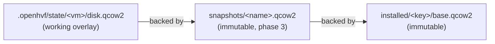

# OpenHVF installed-image caching — Design

## Problem

`openhvf up` on a fresh checkout performs a full OpenBSD installation: it
downloads the miniroot, boots QEMU with it, and drives the installer over the
serial console (`share/openhvf/expect/install.exp`). Under TCG emulation — the
only mode available on CI runners without `/dev/kvm` — this takes tens of
minutes, and the guest-side provisioning that follows (`make deps` running
`pkg_add` in the VM) costs a comparable amount again.

Caching exists today, but only at the workflow layer:
`.github/workflows/integration.yml` archives the whole `.openhvf` state
directory with `actions/cache`, keyed on a hand-maintained `hashFiles(...)`
list. That approach has structural weaknesses:

- **The invalidation knowledge lives in the wrong place.** The key is maintained
  by hand in the workflow and is already incomplete: `install.exp` and the
  install driver in `lib/OpenHVF/{VM,Expect}.pm` are not hashed, so changing how
  the OS is installed does not invalidate the cached disk.
- **The cached artifact is dirty.** `actions/cache` saves only on key miss, so
  what gets frozen is the disk after a full provision-and-test run — test
  artifacts, logs, and the generated root password in `status` included — not a
  pristine installed system.
- **Nothing outside GitHub Actions benefits.** Local developers pay the full
  install on every `openhvf destroy`, and any other CI system would have to
  reimplement the choreography (clean shutdown, socket deletion, key list).

The goal is to move installed-image caching into openhvf itself, so any consumer
— developer machine or CI — gets it natively, with openhvf owning the
invalidation logic.

## Goals

1. A warm `openhvf up` on a fresh checkout boots a cached installed system
   without downloading the miniroot or running the installer.
2. openhvf derives the cache key from the inputs that actually determine an
   installed image; consumers never hand-maintain invalidation lists for the
   base OS install.
3. Cached bases are pristine and immutable: written once at a known-clean point,
   never mutated by later runs, shared by any number of VMs.
4. `openhvf destroy && openhvf up` becomes a cheap factory reset.
5. A generic, named snapshot layer lets scripts (e.g. `vm_provision.sh`) cache
   states openhvf knows nothing about, such as "guest packages installed".
6. The Integration workflow shrinks to one `actions/cache` step over
   `~/.cache/openhvf` and stops archiving `.openhvf` entirely.

## Non-goals

- QEMU internal snapshots (`savevm`): they live inside a single qcow2, make
  nothing smaller or more shareable, and are slow to write under TCG.
- Making the first (cold) installation faster; TCG cost stands.
- Cross-machine or content-addressed image distribution beyond what
  `actions/cache` already provides.
- Caching OpenHAP provisioning policy inside openhvf; the snapshot verb is the
  mechanism, `scripts/vm_provision.sh` keeps the policy.
- Multi-architecture images (`OpenHVF::Image::ARCH` stays `arm64`).

## Architecture

### Cache layout

Everything lives under the existing `cache_dir` (`~/.cache/openhvf`), next to
the proxy cache that already holds the miniroot and install sets:

```
~/.cache/openhvf/
  proxy/...                          # existing: miniroot, install sets
  installed/<key>/
    base.qcow2                       # read-only (0400), compacted
    meta.json                        # 0600: root password, inputs, created_at
    snapshots/<name>.qcow2           # phase 3: named overlay layers
    snapshots/<name>.json
```

`<key>` is `<version>-<arch>-<hash8>`, where `hash8` is a truncated SHA-256
(`Digest::SHA`, core Perl) over the install-determining inputs: OpenBSD version,
architecture, `disk_size`, the content of the `install.exp` script Expect.pm
resolves, and a bumpable `CACHE_GENERATION` constant for driver changes the file
hash cannot see. Memory and port settings do not shape the disk and are
excluded.

### Backing chains

The mechanism is qcow2 backing files — `OpenHVF::Disk::create` already accepts a
backing image (today unused, and hardwired to `-F raw`, which phase 1
parameterizes):



Backing references use absolute paths into `cache_dir`. Bases and snapshots are
immutable per key, published atomically (write to a temp file in the same
directory, then rename), so an overlay either finds the exact file it was
created against or fails loudly.

### Lifecycle integration (`OpenHVF::VM::up`)

- **Save.** `up` already stops the freshly installed VM before rebooting it
  without install media. At that point the disk is clean, pristine, and minimal
  (the SSH key is installed per-checkout afterwards). There, `up` compacts the
  disk into the cache (`qemu-img convert -O qcow2`), writes `meta.json`
  (including the generated root password, which is baked into the installed OS
  and required later by `_needs_ssh_key_update`), replaces the working disk with
  an overlay backed by the new base, and continues. Caching is best-effort: a
  failed save warns and continues with the standalone disk; `up` never fails
  because caching failed.
- **Restore.** When no disk exists and the cache holds a matching key, `up`
  creates the overlay, seeds the state JSON from `meta.json` (`mark_installed`,
  `set_root_password`), and boots straight to "waiting for SSH". The miniroot
  download and proxy-assisted installation are skipped entirely; the existing
  SSH-key update path installs the checkout's key.
- **Integrity.** When a disk exists, `up` verifies its backing chain resolves
  (`qemu-img info`) and fails with a `openhvf destroy` remedy when it does not,
  rather than surfacing an opaque QEMU open error.

### New components

- `OpenHVF::ImageCache` (+ `.pod`, `t/openhvf/imagecache.t`): key derivation,
  lookup, atomic store, metadata, listing, removal. `OpenHVF::Image` keeps its
  present job (miniroot download); it is not extended.
- `openhvf cache list|clear [--stale]`: operator visibility and pruning;
  `--stale` keeps only the key the current configuration derives.
- `openhvf snapshot save|restore|list|rm <name>` (phase 3): copies the working
  overlay into the current base's `snapshots/` (VM stopped), or replaces the
  working disk with a fresh overlay backed by a named snapshot. Snapshot
  metadata records the state fields the disk embodies (installed SSH key, root
  password) so restore can reseed the state JSON.
- Config directive `image_cache yes|no` (default `yes`) and an `up --no-cache`
  escape hatch for debugging.

The originally floated `--cache P` flag is subsumed: `cache_dir` already names
the location, and openhvf deriving the key natively is the point — a
caller-supplied path would move the invalidation problem back to the caller.

### CI target state

One cache step over `~/.cache/openhvf`, keyed on the same inputs openhvf hashes
plus the provisioning inputs (`deps/OpenBSD.txt`, `scripts/vm_provision.sh`),
with a `restore-keys` prefix fallback so a key rotation still restores the
still-valid miniroot and any still-matching bases; `openhvf cache clear --stale`
bounds growth before the post-job save. The `.openhvf` cache step, its socket
cleanup, and the password-bearing archived state all disappear.
`vm_provision.sh` caches its expensive `make deps` result as snapshot
`deps-<hash>` via the snapshot verb.

## Contracts

- A cached base is bit-identical to a just-installed, cleanly shut-down disk; no
  test or provisioning artifact can enter it.
- Same configuration and installer ⇒ same key ⇒ cache hit; any change to
  version, arch, `disk_size`, `install.exp`, or `CACHE_GENERATION` ⇒ new key.
- `meta.json` is mode 0600 and carries the root password; the same secret
  already lives in `.openhvf/state/<vm>/status` today, and these are throwaway,
  localhost-only test VMs — documented in `openhvf.1`.
- Cache failures degrade to today's behavior (full install, standalone disk);
  they are warnings, never errors.
- A broken backing chain is a hard, diagnosed failure with a stated remedy.

## Strategy

Four independently shippable phases:

1. **Core base-image cache** — `OpenHVF::ImageCache`, the `Disk` backing-format
   fix, save/restore wiring in `VM::up`, chain verification, and coupling the
   existing CI cache keys so the two workflow caches rotate together.
2. **Operability** — `openhvf cache` subcommand, `image_cache` directive,
   `up --no-cache`, and documentation in `openhvf.1`.
3. **Named snapshots** — the generic `openhvf snapshot` verb over the same
   backing-chain mechanism.
4. **CI adoption** — single-cache workflow, `.openhvf` never archived,
   `vm_provision.sh` snapshots its `make deps` result.

Once a phase lands, the code, tests, and man page are the source of truth; this
document records intent at the time of writing.
