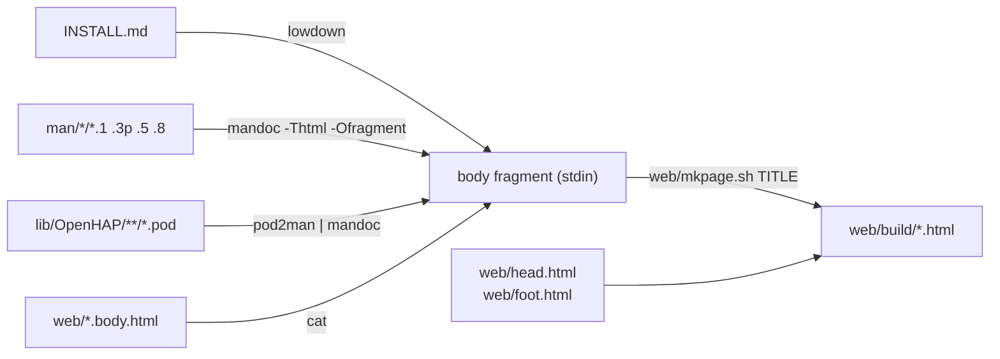

# OpenHAP website — Design

## Problem

OpenHAP has no public face. Everything a prospective user needs — what the
project is, how to install it, what the tools do — exists only as Markdown and
mdoc(7) inside the repository. There is nowhere to point someone.

The obvious failure mode for a project website is that it becomes a fourth copy
of the documentation, drifting from `README.md`, `INSTALL.md`, and `man/` the
moment any of them changes. The repository's documentation rule — every fact
lives in exactly one place — has to survive the addition of a web presence.

Building the site also exposes a gap it cannot paper over: FuguLib is presented
as a reusable OpenBSD-style library but has no manuals. Four of its six modules
have `.pod` sidecars; `Log` and `State` have nothing.

## Goals

1. A static site under `web/`, buildable by `make web`, served as plain files.
2. Manuals rendered to HTML from their sources, never copied: one source, two
   outputs (terminal and web).
3. Rendered manuals look and read like manual pages — `NAME`, `SYNOPSIS`,
   section headers, the running header and footer bars.
4. Flat navigation covering OpenHAP and the two sub-projects, OpenHVF and
   FuguLib, each with its own manuals.
5. FuguLib gains mdoc(7) section 3p manuals for all six modules, installed like
   any other manual — useful at a terminal, website or no website.
6. A build system with no new language or toolchain: make, two short `sh`
   scripts, renderers that read formats already in the tree.
7. Look and feel heavily inspired by openbsd.org — serif body text, plain pages,
   no JavaScript, late-1990s restraint.

## Non-goals

- Client-side scripting, web fonts, analytics, cookies, CSS frameworks,
  minification, images beyond a favicon, or a generator with templates, layouts,
  front matter, and a plugin model.
- Converting the OpenHAP and OpenHVF `.pod` sidecars to mdoc. They document
  internal implementation modules; the sidecar rule stands for them.
- Rendering `spec/`, `plans/`, or `TODO.md` — contributor working documents the
  repository already serves.
- Responsive breakpoints. The page is one column of text; it reflows because
  HTML reflows.
- Search, versioned docs, a news feed, or hosting beyond GitHub Pages.

## Architecture

### Sitemap

Output is a **single flat directory**, so every link is a bare filename, no page
needs to know its depth, and mandoc's `-O man=` templates work unmodified.

```
web/build/
  index.html      OpenHAP — what it is, features, quick start
  install.html    rendered from INSTALL.md
  manuals.html    index of every manual, grouped by project
  openhvf.html    OpenHVF — the QEMU test harness
  fugulib.html    FuguLib — OpenBSD-style daemon utilities
  openhapd.8.html  hapctl.8.html  openhapd.conf.5.html  openhvf.1.html
  FuguLib.Daemon.3p.html … FuguLib.State.3p.html  (six, from mdoc)
  OpenHAP.HAP.3p.html …                           (one per .pod sidecar)
  style.css
```

Navigation is identical on every page:
`OpenHAP · Install · Manuals · OpenHVF · FuguLib · GitHub`. That is the whole
hierarchy — two levels, no menus, no breadcrumbs.

### Build pipeline

Source formats converge on one HTML _body fragment_, wrapped by one script in
the shared page chrome:



`web/mkpage.sh <title>` is the only assembler: it substitutes `@TITLE@` into
`head.html`, copies stdin, appends `foot.html`. Titles are literal and contain
no `/` or `&`, so `sed` substitution is safe. Every pipeline above is one line
in the Makefile; no logic lives in the scripts beyond this. `web/mkindex.sh` is
the second and last script: given the manual source paths it emits the body of
`manuals.html`, so that list cannot drift as manuals are added.

### Manual rendering

- **mdoc pages** — `man/openhap/*`, `man/openhvf/*`, and the new
  `man/fugulib/*.3p` — go through
  `mandoc -Thtml -O fragment,man='%N.%S.html;https://man.openbsd.org/%N.%S'`.
  mandoc picks the first template when a file named `%N.%S` exists _in the
  current directory_ and the second otherwise, so `.Xr openhapd 8` links locally
  while `.Xr pledge 2` leaves for man.openbsd.org. That test is
  directory-relative, so all mdoc sources are staged into one directory
  (`web/build/.man/`) that mandoc is run from.
- **POD sidecars** under `lib/OpenHAP/` go through core `pod2man` into man(7)
  and then the same mandoc invocation — one renderer, one stylesheet, one visual
  result. `lib/OpenHAP/Tasmota/Heater.pod` becomes name
  `OpenHAP::Tasmota::Heater`, section `3p`, file
  `OpenHAP.Tasmota.Heater.3p.html`; `/` maps to `::` in the name and `.` in the
  filename. `L<>` links do not survive `pod2man`, so those pages cross-reference
  as plain text — accepted, not worked around.
- **Markdown** (`INSTALL.md`) goes through `lowdown -Thtml`, chosen over a CPAN
  renderer for the same reason mandoc is: a small ISC C program from the same
  lineage, packaged on all three platforms, develop-only.

### FuguLib manuals

FuguLib's six modules get hand-written mdoc(7) pages in `man/fugulib/`, one per
module, replacing the four `.pod` sidecars and documenting `Log` and `State` for
the first time. Section is **3p** — what OpenBSD uses for Perl module manuals
(`/usr/local/man/man3p/JSON::XS.3p`) — so `man FuguLib::Daemon` works on an
installed system.

Source files drop the `FuguLib::` prefix, because a colon is a rule separator to
make and cannot appear in a target; the title comes from
`.Dt FuguLib::Daemon 3p` inside the file, and `install-man` renames:
`man/fugulib/Daemon.3p` → `$(MANDIR)/man3p/FuguLib::Daemon.3p` →
`FuguLib.Daemon.3p.html`.

This splits the API-documentation rule along a real seam: FuguLib is a library
others may use, documented where a library is documented; OpenHAP and OpenHVF
modules are internal and keep `.pod`. The root `CLAUDE.md` table says so.

### Look and feel

One hand-written `web/style.css`, no preprocessor. The visual target is
openbsd.org: `"Times New Roman", Times, serif` body text on white, `#23238e`
links (unvisited and visited alike, active `#ff0000`), `"Courier New"` for code
and manual literals, colored heading bands, `<hr>` between sections, a plain
text footer. It also carries mandoc's own class names (`.head`, `.foot`,
`.manual-text`, `.Sh`, `.Nm`, `.Fl`, `.Ar`, `.Pa`, `.Cm`) so manual pages
inherit the site's typography rather than shipping mandoc's default stylesheet
alongside ours.

Two deliberate deviations from period authenticity: **the markup is current**
(HTML5 doctype, semantic elements, no layout tables, no `<font>` — the aesthetic
is 1990s, the accessibility is not), and **text is capped at `55em`,
left-aligned**, because openbsd.org's full width is unreadable on a modern
display. Everything else stays plain — no centering, cards, or shadows.

### Make integration

Targets live in the top-level `Makefile` and use only constructs it already
relies on (`?=`, `!=`, `%` pattern rules), so the build works under OpenBSD make
and GNU make alike. `web` builds into `$(WEBOUT)` (default `web/build`,
overridable so tests can use a temporary directory); `web-clean` is invoked by
`clean`. `MANDOC` is reused as-is from `make man`; `MAN3P` joins
`MAN1`/`MAN5`/`MAN8` with a `%.cat3p: %.3p` rule and a `man3p` install step. The
site is never part of `install`, `package`, or `check`; the FuguLib manuals are
part of `install` and `package`.

`t/web/site.t` carries the site's tests, following the unit-test convention
(`plan skip_all` when a renderer is absent); `make test` gains
`prove -l -v t/web/*.t`. Per-phase assertions live in the plan files.

## Contracts

- No prose that exists in `README.md`, `INSTALL.md`, `man/`, or a `.pod` sidecar
  is retyped under `web/`. Adding a manual adds a site page with no edit to any
  hand-written HTML.
- Exactly one API-documentation format per module: FuguLib is mdoc, everything
  else is `.pod`. No module has both.
- The site is a pure function of the repository — same checkout, same output.
  The build reads nothing from the network, writes nothing outside `$(WEBOUT)`.
- Rendered manuals are recognisably manual pages: the mandoc structure is
  preserved and styled, never restructured.
- Every page is reachable from every other page through the same six-item nav.
- A missing renderer fails the target with a named tool rather than silently
  emitting a partial site.
- `web/` adds no runtime dependency and nothing to the installed footprint;
  `mandoc` and `lowdown` are develop-only.

## Strategy

Five independently shippable phases:

1. **Skeleton, look and feel, build system** — page chrome, stylesheet,
   `mkpage.sh`, the three hand-written project pages, `install.html` from
   `INSTALL.md`, the `web` target, `t/web/site.t`. A complete four-page site.
2. **mdoc manuals** — the four in-tree man pages, the `.man/` staging directory,
   cross-reference linking, `mkindex.sh` and `manuals.html`.
3. **FuguLib section 3p manuals** — six mdoc pages, the four `.pod` sidecars
   retired, `MAN3P` built, installed and packaged, the `CLAUDE.md` rule amended,
   the pages rendered onto the site. Valuable at a terminal independently of the
   website.
4. **OpenHAP POD manuals** — `pod2man | mandoc` over every `lib/OpenHAP/`
   sidecar; `manuals.html` extends to cover them.
5. **Publish** — GitHub Pages workflow, a CI job that builds and link-checks the
   site, `404.html`, `web/CLAUDE.md`.

Once a phase lands the code and the site are the source of truth; this document
records intent at the time of writing.
