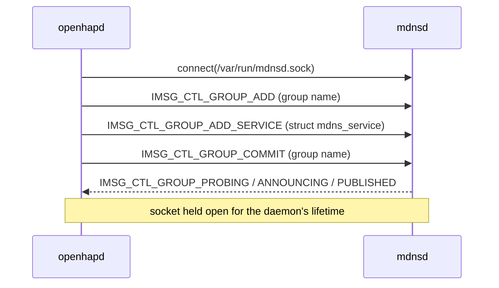

# pledge(2) and unveil(2) for openhapd — Design

## Problem

`README.md` says OpenHAP is "Native with pledge(2)/unveil(2) support",
`CLAUDE.md` names them as the production platform's defining property, and
`web/index.body.html` links both man pages. None of it is true: there is no
`pledge` or `unveil` call anywhere in `bin/` or `lib/`, no `FuguLib` module for
either, and no test. `TODO.md:10-20` records the gap accurately.

`bin/openhapd` daemonizes, drops to `_openhap`, then enters `HAP::run`. A
compromised TLV or HTTP parser therefore has the full syscall surface and the
whole filesystem, limited only by uid.

One structural obstacle stands in the way. `OpenHAP::MDNS` advertises the
service by spawning `mdnsctl publish` as a long-lived child (`MDNS.pm:117`,
killed at shutdown by `MDNS.pm:152`), and any pledge covering that must include
`proc exec` — most of what pledge exists to take away. The child exists only
because `mdnsctl` holds the advertisement open for as long as its control socket
is open, and openhapd can hold that socket itself.

## Goals

1. `openhapd` runs its event loop under a single `pledge(2)` promise set with no
   `proc`, `exec`, or `prot_exec`, and under a locked `unveil(2)` view.
2. The pledge/unveil API is a `FuguLib` platform abstraction: real on OpenBSD, a
   no-op on Linux and Darwin, so `make check` behaves identically everywhere.
3. mDNS advertisement speaks to `mdnsd(8)` over `/var/run/mdnsd.sock` directly:
   no child process, no `mdnsctl.log`, no kill-on-shutdown.
4. Failures fail closed: an unappliable restriction on OpenBSD is fatal.
5. The restrictions are proven by tests that fail if they are silently absent.

## Non-goals

- **Two-stage or per-phase pledges.** One promise set, applied once. Tightening
  after pairing, or a separate pre-privdrop stage, is a later refinement;
  correctness now beats minimality now.
- **Privilege separation** into helper processes (`TODO.md:489`), and **pledging
  `hapctl`** — both follow-ups, the latter cheap once `FuguLib::Sandbox` exists.
- **Weakening the documentation.** `README.md`, `CLAUDE.md` and `web/` keep
  their claims; phase 3 makes them true rather than the docs shrinking to fit.
- **Fixing `pv=1`.** `HAP.pm:1087` sends protocol version `1`, not `1.1`,
  because mdnsd splits TXT strings on `.` with no escape. A native client hands
  mdnsd the same dot-delimited payload, so the constraint is unchanged.
- Bonjour/Avahi backends; mDNS stays OpenBSD-only, exactly as today.

## Should the mDNS client be a fourth sub-project?

No. The FuguLib/OpenHVF precedent splits on **lifecycle and audience**, not on
subject matter. OpenHVF earned a namespace by being a separate _program_: its
own entry point, config format, and man page section, development-only, never
installed. FuguLib is the other shape — shipped libraries, reusable by any
OpenBSD daemon, documented as `man/fugulib/<Module>.3p`. An mdnsd client is the
FuguLib shape exactly: a shipped library with no CLI, no config, and no user of
its own. So is a pledge wrapper. A fourth namespace would buy nothing and cost
`install` rules, a man-page rename loop, a test directory, a `CLAUDE.md`, and
web index wiring, for two modules. Precedent also says FuguLib _absorbs_ —
`OpenHAP::Log` became `FuguLib::Log` and the OpenHAP copy went away — and this
design does the same to `OpenHAP::MDNS`. Revisit only when the client grows what
OpenHVF has: a browse/resolve API with consumers outside this repo, or a `bin/`
tool of its own.

## Architecture

Three new `FuguLib` modules — `Sandbox` (pledge/unveil) and `MDNS` (the mdnsd
group protocol) over `Imsg` (framing) — one deletion, one new call site.

### `FuguLib::Sandbox`

One module covering both mechanisms, because they are one decision applied at
one point; a module named `Pledge` that also unveils would misname itself.

- `is_supported()` — true only on OpenBSD.
- `pledge(promises => $string)` — 1 on success, `die` on failure.
- `unveil(path => $perms, ...)` — applies each pair, `die` on failure.
- `unveil_lock()` — `unveil(undef, undef)`; no path can be added afterwards.

On OpenBSD the base-system `OpenBSD::Pledge`/`OpenBSD::Unveil` load at `use`
time and failing to load is fatal: there, their absence means a broken Perl, not
an unsupported system. Off OpenBSD every method returns 1 having done nothing,
logging once at debug so a misread test cannot mistake a no-op for enforcement.

### `FuguLib::Imsg` and `FuguLib::MDNS`

`mdnsctl publish` performs a four-message conversation and then simply stays
alive; mdnsd withdraws the record when the control socket closes.



`FuguLib::Imsg` is the framing layer: a 16-byte native-endian header (`type`
u32, `len` u16 counting the header, `flags` u16, `peerid` u32, `pid` u32) plus
payload, and buffered reads yielding whole messages — pure serialisation,
unit-testable with no daemon present.

`FuguLib::MDNS` is the protocol layer: `connect`, `publish_service`,
`update_txt` (`GROUP_RESET` → `GROUP_ADD_SERVICE` → `GROUP_COMMIT` on the same
socket, no reconnect), `withdraw` (close), and translation of reply types —
including `GROUP_ERR_COLLISION`, `GROUP_ERR_NOT_FOUND`, `GROUP_ERR_DOUBLE_ADD` —
into logged outcomes. Its payload is a raw `struct mdns_service`
(`mdnsd/mdns.h`), which couples this code to mdnsd's ABI. That is the design's
principal risk and is treated as one: phase 1 verifies the layout against the
installed openmdns before writing the client, and pins the size constants in one
place. Field offsets live in `plan-1.md`.

`OpenHAP::MDNS` and its `.pod` are deleted. `bin/openhapd` and
`HAP::update_txt_records` (`HAP.pm:148`) talk to `FuguLib::MDNS`; the
HAP-specific `_hap`/`tcp`/TXT knowledge stays where it already lives, in
`HAP::get_mdns_txt_records`.

### The promise set

One string, applied after mDNS registration and before `$hap->run()`. Every
promise is there for a reason that outlives startup:

```
stdio rpath wpath cpath fattr flock inet dns unix
```

| promise       | required by                                                      |
| ------------- | ---------------------------------------------------------------- |
| `stdio`       | always                                                           |
| `rpath`       | `/dev/urandom` (`Crypto.pm:35`), `Storage` reads, lazy `require` |
| `wpath cpath` | `Storage` writes, `make_path` (`Storage.pm:14`), log file        |
| `fattr`       | `chmod 0600` (`Storage.pm:158`, `:240`)                          |
| `flock`       | `Storage.pm:62,82,139,155`                                       |
| `inet`        | listen socket built in `HAP::run` (`HAP.pm:158`), MQTT reconnect |
| `dns`         | MQTT reconnect resolving `mqtt_host` when it is a name           |
| `unix`        | the held `/var/run/mdnsd.sock` connection                        |

Deliberately absent: `proc exec` (phase 1 removes the only `exec`), `prot_exec`
(see below), `getpw` and `id` (`getpwnam` and privdrop both precede pledge),
`sendfd recvfd`. Syslog needs no promise — `Sys::Syslog` in native mode reaches
`sendsyslog(2)`, which pledge always permits. The constraint this imposes on
future work is the point: implementing SIGHUP-as-reload (`TODO.md:141`) must not
re-exec, or `exec` returns to the set and most of the benefit is gone.

### Late loading, and why `prot_exec` stays out

Perl loads code lazily, and two such loads happen _after_ the pledge point:
`Math::BigInt` pulls in `Math::BigInt::GMP` on first use — during pairing — and
`OpenHAP::MQTT` `require`s `Net::MQTT::Simple`, which a failed startup
connection defers to the first reconnect. `dlopen` of an XS object needs
`prot_exec`, so both are handled beforehand:

- **Preload** every XS dependency and force one GMP-backed `Math::BigInt`
  operation, so no shared object opens after pledge; `localtime` is called once
  so `/usr/share/zoneinfo` need not be unveiled.
- **Unveil `@INC` read-only**, so pure-Perl lazy loads still resolve. This is
  the deliberate simplicity trade: weaker than proving every load is preloaded,
  and far more robust than discovering a missed `require` in production.

### The unveil view

Read-only for the config file, `/dev/urandom`, the resolver files and the `@INC`
directories; read-write-create for `$db_path`; write for the daemon log;
read-write for `/var/run/mdnsd.sock`, because `connect(2)` needs write
permission on the path. Then `unveil_lock()`, then `pledge`; the exact inventory
is in `plan-3.md`. Both come after privdrop: unveil only removes reachability,
so applying it as `_openhap` is correct and keeps the root-only `chown` loop
(`bin/openhapd:118-137`) working unchanged.

## Contracts

- On OpenBSD, `openhapd` never reaches `HAP::run` without both restrictions
  applied; failing to apply either is fatal before the loop starts. Off OpenBSD,
  behaviour is byte-identical to today.
- The socket to mdnsd is the advertisement's lifetime. Closing it withdraws the
  service — that is how shutdown unregisters. No signal, no child, no kill.
- A `FuguLib::MDNS` failure stays non-fatal, exactly as `OpenHAP::MDNS` failure
  is today: HAP still serves, discovery is degraded, a warning is logged.
- mDNS advertisement is lost if `mdnsd` restarts and is not re-established until
  `openhapd` restarts. Parity with today — the `mdnsctl` child dies the same way
  — so it is documented, not fixed.
- The `struct mdns_service` layout is verified by a test that fails loudly on
  mismatch, never by silent truncation.

## Strategy

Four phases. Phase 1 must precede 2: `proc exec` cannot leave the promise set
while a child is spawned.

1. **mDNS without exec** — `FuguLib::Imsg`, `FuguLib::MDNS`, ABI verification,
   `OpenHAP::MDNS` deleted, `bin/openhapd` and `HAP.pm` rewired.
2. **`FuguLib::Sandbox` and pledge** — the platform abstraction with man page
   and tests, XS/timezone preloading, and the promise set applied.
3. **unveil** — the path inventory including `@INC`, `unveil_lock`, ordering
   against privdrop.
4. **Proof and operability** — negative integration tests in the OpenBSD VM that
   fail if either restriction is absent, an `openhapd.8` SECURITY section, and
   the `TODO.md` items closed.

Once a phase lands, the code, tests, and man pages are the source of truth.
