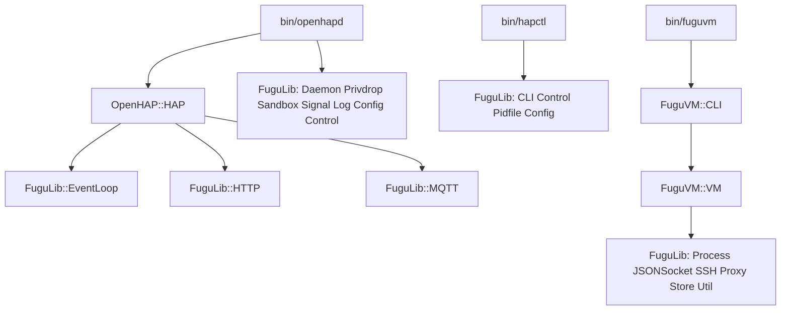

# FuguLib consolidation — Design

## Problem

The repository has three namespaces. FuguLib is the generic daemon library, but
it holds only a part of the generic code. OpenHAP and FuguVM each carry
infrastructure that is not specific to their domain. The same concerns exist
two, three, or four times:

- Three config parsers read the same `key = value` plus block grammar
  (`OpenHAP::Config`, `FuguVM::Config`, `OpenHAP::Test::Integration`).
- Three HTTP codecs exist, and only the two test clients frame messages by
  `Content-Length`; the server does not (`OpenHAP::HTTP`, `Test::Controller`,
  `Test::Integration`).
- Two newline-JSON socket clients share ~120 identical lines (`FuguVM::QMP`,
  `FuguVM::QGA`).
- Three PID-file implementations exist, and two of them have no `flock` and
  count zombies as live processes (`FuguLib::State`, `FuguVM::State` twice).
- Four file read/write helpers exist (`FuguVM::CLI`, `FuguVM::ImageCache`,
  `FuguVM::State`, `OpenHAP::Storage`).
- Two alarm guards exist, and a comment in `FuguVM::VM::_bounded` admits the
  duplication with `OpenHAP::MQTT`.
- Three logger conventions exist (`$OpenHAP::logger`, `FuguVM::Output`,
  `FuguVM::CLI`).

The duplicates drift, and the weakest copy usually wins. The project has no
users yet, so a clean break is possible: no shims, no compatibility layers.

## Goals

1. FuguLib holds all generic code: daemon lifecycle, files, state, config, CLI,
   sockets, HTTP, MQTT, SSH, crypto primitives, event loop, control socket.
2. OpenHAP holds only the HAP protocol, the accessory data model, the Tasmota
   drivers, and openhapd policy. `bin/openhapd` and `bin/hapctl` become thin
   wiring over FuguLib.
3. FuguVM holds only QEMU, disk, image, and OpenBSD-install logic, plus its
   caching policy. Everything else comes from FuguLib.
4. Each concern has exactly one implementation.
5. FuguLib gets one consistent interface convention (see Contracts).
6. Known bugs in the duplicated code die with the duplicates (see Contracts).

## Non-goals

- Backward compatibility. Old interfaces are removed, not deprecated.
- New protocol features: no mDNS browse or resolve, no chunked HTTP, no
  multi-service mDNS publication, no MQTT v5.
- Changes to the HAP wire behavior, other than the listed bug fixes.
- Changes to `rc.d`, packaging layout, or the dependency manifests.
- A generic plugin registry. `OpenHAP::DeviceLoader` keeps its dispatch, but
  collapses its three copies of the type table into one.

## Architecture

### Target FuguLib

Twenty-two modules. Bold names are new; the others exist and are redesigned.

| Module         | Source of the code                       | Function                                                            |
| -------------- | ---------------------------------------- | ------------------------------------------------------------------- |
| Daemon         | FuguLib::Daemon                          | fork, setsid, chdir, umask, fd redirect, PID file                   |
| Privdrop       | FuguLib::Privdrop, `bin/openhapd` chown  | drop privileges, prepare the state directory before the drop        |
| Sandbox        | FuguLib::Sandbox, `OpenHAP::Daemon`      | pledge, unveil, standard system paths, Perl library paths           |
| Signal         | FuguLib::Signal                          | per-object handlers, cleanups, interrupt flag                       |
| Log            | FuguLib::Log                             | syslog/stderr/quiet, `reopen`, process default instance             |
| Process        | FuguLib::Process, `FuguVM::SSH`          | spawn, capture output, terminate, reap, wait                        |
| Pidfile        | FuguLib::State                           | locked PID file; rename says what it is                             |
| Imsg           | FuguLib::Imsg                            | imsg framing with peerid, `close`, `is_dead`                        |
| MDNS           | FuguLib::MDNS                            | one-call publish, withdraw on destroy                               |
| **File**       | 4 copies, see Problem                    | slurp, spew, atomic write, JSON files, dirs, `~`, share paths       |
| **Util**       | `FuguVM::VM`, `OpenHAP::MQTT`, 3 pollers | `bounded`, `wait_until`, `format_size`                              |
| **Crypto**     | `OpenHAP::Crypto`, `FuguVM::Util`        | random bytes/password; Ed25519, X25519, ChaCha20-Poly1305, HKDF     |
| **Config**     | 3 parsers, see Problem                   | one grammar; ordered block list and named block hash                |
| **Store**      | `FuguVM::State`, `OpenHAP::Storage`      | atomic JSON state file with typed accessors                         |
| **CLI**        | `FuguVM::CLI`, `bin/hapctl`              | subcommand dispatch, option layers, exit codes, usage               |
| **JSONSocket** | `FuguVM::QMP`, `FuguVM::QGA`             | newline-JSON client over a UNIX socket                              |
| **SSH**        | `FuguVM::SSH`                            | Net::SSH2 runner, SFTP write, availability poll                     |
| **MQTT**       | `OpenHAP::MQTT`                          | subscriptions, wildcard match, reconnect, `tick`                    |
| **HTTP**       | 3 codecs, see Problem                    | request/response parse and build, with Content-Length framing       |
| **Proxy**      | `FuguVM::Proxy{,::Cache,::MetaCache}`    | caching HTTP proxy; cache and metadata as packages in the same file |
| **EventLoop**  | `OpenHAP::HAP::run`                      | IO::Select fd handlers, timers, signal-aware stop                   |
| **Control**    | new, over Imsg                           | UNIX control socket: server handlers and a request/response client  |

### Target OpenHAP

`HAP` (endpoints, events, mDNS TXT policy, on EventLoop), `TLV`, `SRP` (gains
the RFC 5054 group constants), `Pairing`, `Session`, `PIN`, `Accessory`,
`Service`, `Characteristic`, `Bridge`, `Storage` (pairing format and `c#`
semantics over Store), `DeviceLoader` (one table), `Tasmota::*`, `Test::*`.

Deleted: `OpenHAP::Config`, `OpenHAP::Crypto`, `OpenHAP::Daemon`,
`OpenHAP::HTTP`, `OpenHAP::MQTT`. The `$OpenHAP::logger` global is deleted; code
uses `FuguLib::Log->default`.

### Target FuguVM

`VM`, `Disk`, `Image`, `ImageCache`, `Expect`, `Config` (VM defaults over
FuguLib::Config), `State` (pure persistence over Store and Pidfile), `CLI`
(subcommand bodies over FuguLib::CLI), `QMP` and `QGA` (command sets over
JSONSocket), `Proxy` (OpenBSD mirror policy over FuguLib::Proxy).

Deleted: `FuguVM::Output` (unreferenced), `FuguVM::Util`, `FuguVM::SSH`,
`FuguVM::Proxy::Cache`, `FuguVM::Proxy::MetaCache`. The `State` to `Proxy`
require cycle is removed: proxy lifecycle moves to `VM`.

### Wiring after the change

`hapctl` gets a live channel: `openhapd` serves `status` and `devices` over a
FuguLib::Control socket. `hapctl` keeps its offline `check` command and falls
back to the PID file when the socket is absent.

## Contracts

- FuguLib does not know OpenHAP or FuguVM. No names, paths, or defaults leak.
- FuguLib loads with core Perl only. Modules that wrap CPAN libraries (MQTT,
  SSH, Crypto signatures, Proxy) `require` them lazily and fail with a clear
  message. A pledge-constrained daemon must preload the shared objects of every
  lazily loaded module before it pledges; `openhapd` keeps `prot_exec` out of
  its promise set, so it warms up the Crypt::\* and MQTT modules first.
- The install target ships `lib/FuguLib/*.pm` and all 3p pages wholesale.
  Modules whose CPAN library sits in the test or develop dependency tier (SSH,
  Proxy) install too; without the library they are inert and fail with the clear
  lazy-require message. The dependency manifests do not change.
- Interface convention: object modules use `Class->new(%args)` with named
  arguments and named `$class`/`$self` invocants; stateless helpers (File, Util,
  Process, Sandbox, Privdrop, Daemon) use class methods. Everything `die`s for
  programming errors. Recoverable failures return `undef`, with an `error`
  accessor on object modules and an error field in hashref results where a
  method returns one (Process).
- Logger convention: modules take `log => $logger` and fall back to
  `FuguLib::Log->default`, which always returns a logger. Library code never
  dies for the lack of a logger.
- Every FuguLib module ships a `man/fugulib/<Module>.3p` page, a `MAN3P` entry,
  and a `t/fugulib/` test. Moved OpenHAP and FuguVM modules keep `.pod` sidecars
  next to the `.pm`.
- HAP wire behavior is unchanged, except these deliberate fixes: the server
  buffers per connection, frames requests by `Content-Length`, and enforces
  request-size limits; `openhapd` writes its PID file; `hapctl status` reports
  real state.
- The PID file is a trust anchor: root writes `/var/run/openhapd.pid` before the
  privilege drop and keeps it root-owned, so the unprivileged daemon cannot
  rewrite it. The daemon does not remove it at exit — unlink in root-owned
  `/var/run` is impossible after the drop — and `Pidfile` stale detection covers
  leftovers.
- Security fixes ride along: PID files lock before truncate; liveness checks
  reap zombies; secret files get mode 0600 before the write, not after; the
  Privdrop re-escalation check fails loudly; Privdrop clears supplementary
  groups by default.
- `make check` and `make spec-coverage` stay green after every phase.

## Strategy

Six phases, each independently shippable:

1. **Harden the existing nine** — redesign Daemon, Privdrop, Sandbox, Signal,
   Log, Process, Pidfile (rename from State), Imsg, MDNS; `openhapd` writes its
   PID file.
2. **Foundation modules** — add File, Util, Crypto, Config, Store, CLI,
   JSONSocket, with pages and tests; no consumers change.
3. **FuguVM conversion** — move SSH and Proxy into FuguLib; QMP/QGA onto
   JSONSocket; State, Config, CLI onto the foundations; delete Output, Util.
4. **OpenHAP conversion** — move MQTT, HTTP, Crypto into FuguLib; Storage onto
   Store; delete Config, Daemon, the logger global; fix request framing.
5. **Event loop** — extract FuguLib::EventLoop; `HAP::run` becomes
   registrations; shutdown honors the interrupt flag.
6. **Control socket** — add FuguLib::Control; `openhapd` serves it; rewrite
   `hapctl` on FuguLib::CLI with live status.

Once a phase lands, the code, tests, and man pages are the source of truth; this
document records intent at the time of writing.
