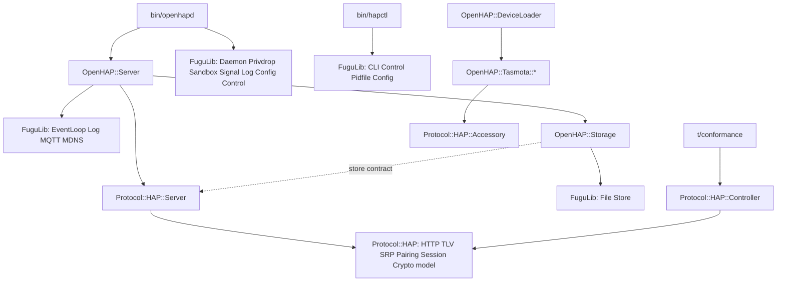

# Protocol::HAP extraction — Design

## Problem

OpenHAP mixes two products in one namespace. `lib/OpenHAP/` holds the generic
HAP protocol and the OpenBSD product that ships it. The protocol code binds to
FuguLib for logging, crypto, HTTP, and persistence. No other program can reuse
the protocol without adopting the whole daemon toolkit.

Plan 006 moved the generic daemon code into FuguLib. The opposite extraction did
not happen: the protocol itself is not a library. The project goal is an
open-source design that invites more HAP implementations. A reusable protocol
library, later published to CPAN, is that invitation.

The project has no users. A clean break is possible: no shims, no aliases, no
compatibility layers. Old names die when their replacement lands.

## Goals

1. `Protocol::HAP` holds the complete HAP protocol: the TLV8 and HTTP codecs,
   crypto, SRP-6a, pairing, sessions, the accessory data model, the
   accessory-server engine, and a controller.
2. `Protocol::HAP` is self-contained. It uses core Perl plus the declared crypto
   CPAN modules only. It never uses FuguLib, FuguVM, or OpenHAP.
3. The engine is sans-IO. It consumes bytes and emits bytes. The host owns
   sockets, timers, logging, and persistence through narrow injected contracts.
4. OpenHAP becomes the reference host: `openhapd`, `hapctl`, MQTT, Tasmota
   drivers, and OpenBSD policy.
5. The repository stays whole. A later CPAN split of the `Protocol-HAP`
   distribution is mechanical, not architectural.
6. Wire behavior does not change. Every spec citation in `t/conformance/` keeps
   its meaning.

## Non-goals

- No CPAN release in this effort. PAUSE registration, `$VERSION` policy, and
  distribution tooling are release work, recorded in `TODO.md`.
- No new protocol features.
- No changes to FuguVM.
- No repository split.

## Architecture

### Target Protocol::HAP

New namespace under `lib/Protocol/`. Bold names are new; the others move.

| Module            | Source of the code                  | Function                                                                |
| ----------------- | ----------------------------------- | ----------------------------------------------------------------------- |
| **Protocol::HAP** | new                                 | umbrella documentation, the null logger, shared HAP constants           |
| TLV               | OpenHAP::TLV                        | TLV8 codec                                                              |
| PIN               | OpenHAP::PIN                        | setup-code normalization and rules                                      |
| Crypto            | FuguLib::Crypto                     | random bytes; Ed25519, X25519, HKDF-SHA-512, ChaCha20-Poly1305; preload |
| SRP               | OpenHAP::SRP, Test::Controller::SRP | SRP-6a, accessory and controller roles                                  |
| Pairing           | OpenHAP::Pairing                    | pair-setup and pair-verify state machines, TLV constants                |
| Session           | OpenHAP::Session                    | per-connection state and the AEAD frame codec; no socket                |
| HTTP              | FuguLib::HTTP                       | HAP's HTTP/1.1 subset codec, EVENT/1.0 builder                          |
| Accessory         | OpenHAP::Accessory                  | data model                                                              |
| Service           | OpenHAP::Service                    | data model                                                              |
| Characteristic    | OpenHAP::Characteristic             | data model                                                              |
| Bridge            | OpenHAP::Bridge                     | data model                                                              |
| **Server**        | OpenHAP::HAP, the protocol half     | endpoint dispatch, pairings management, events, c# digest, mDNS records |
| **Store::Memory** | new                                 | reference store implementation, for tests and documentation             |
| Controller        | OpenHAP::Test::Controller           | the controller side; the conformance suite drives it                    |

### Target OpenHAP

The product keeps: **`OpenHAP::Server`** (new, the host half of `OpenHAP::HAP`),
`Storage`, `DeviceLoader`, `Tasmota::*`, and `Test::Integration`.

Deleted: `OpenHAP::HAP`, `TLV`, `PIN`, `SRP`, `Pairing`, `Session`, `Accessory`,
`Service`, `Characteristic`, `Bridge`, `Test::Controller`, and
`Test::Controller::SRP`. Each dies when its replacement lands, in the same
phase.

### Target FuguLib

- `FuguLib::Crypto` becomes **`FuguLib::Random`**: `random_bytes` and
  `random_password` only. The Crypt::\* groups move to `Protocol::HAP::Crypto`.
- `FuguLib::HTTP` moves wholesale to `Protocol::HAP::HTTP`. Only OpenHAP code
  uses it today; `FuguLib::Proxy` has its own minimal parser.
- `FuguLib::MDNS` gains `format_txt(%records)`: the sorted, `.`-joined TXT
  string of mdnsd [MDNS-Control §5]. The join is mdnsd's format, not HAP's.
- Everything else is unchanged.

### Host contracts

`Protocol::HAP` receives its environment through five contracts. Each is a
constructor argument.

1. `logger` — an object with `debug`, `info`, `warning`, and `error` methods
   that take printf-style arguments. The default is the null logger in
   `Protocol::HAP`. `FuguLib::Log->default` conforms unchanged. Objects that a
   class creates internally inherit its logger.
2. `store` — an object with these twelve methods: `load_accessory_keys`,
   `save_accessory_keys`, `load_pairings`, `save_pairing`, `remove_pairing`,
   `remove_all_pairings`, `get_config_number`, `increment_config_number`,
   `get_config_digest`, `save_config_digest`, `get_auth_attempts`,
   `set_auth_attempts`. `OpenHAP::Storage` conforms unchanged.
   `Protocol::HAP::Store::Memory` is the reference implementation.
3. `output` — a code ref `sub ($session, $bytes)`. The engine sends every write
   through it: responses and EVENT notifications alike. The host writes the
   bytes to the connection that it filed the session under.
4. `after` and `cancel` — code refs for one-shot timers, used for event
   coalescing [HAP-HTTP §14]. `FuguLib::EventLoop` provides both directly. They
   are optional: without them, the host must call `flush_events`. Conformance
   tests do that.
5. `on_pairing_changed` — an optional code ref `sub ($paired)`. The engine calls
   it when the paired state flips. The host re-advertises the mDNS TXT record
   [HAP-mDNS §8].

### The connection contract

`Protocol::HAP::Server` owns protocol state; the host owns descriptors.

- `session_open` returns a new `Protocol::HAP::Session`. The server allocates
  session ids from an instance counter.
- `receive($session, $bytes)` decrypts, buffers, parses, dispatches, and emits
  responses through `output`. It returns 1, or undef on a fatal condition: a
  failed decryption or an over-limit request. On undef the host closes the
  connection.
- `session_close($session)` releases the pairing lock and the event
  subscriptions that the session holds.
- The request bound (64 KB) and the read buffer live in the engine, because an
  unauthenticated client reaches `/pair-setup`.
- `mdns_txt_records` returns the TXT records as a hash [HAP-mDNS §3]. The host
  formats and publishes them.

### Wiring after the change

## Rules

- Dependency direction: `Protocol::HAP` uses core Perl plus `Crypt::Ed25519`,
  `Crypt::Curve25519`, and `CryptX`, loaded lazily as today. `FuguLib` never
  uses `Protocol::HAP` or `OpenHAP`. `OpenHAP` uses both.
  `t/protocol/boundary.t` enforces all three directions.
- JSON: `Protocol::HAP` uses core `JSON::PP`. HAP payloads are small, so XS
  speed buys nothing, and one fewer dependency does. OpenHAP and FuguLib keep
  `JSON::XS`.
- No package-level mutable state in `Protocol::HAP`. The pairing lock and the
  attempt counter become `Pairing` instance state. Session ids become a `Server`
  instance counter. Two servers in one process must not share state.
- Sans-IO, with two documented exceptions: `Crypto` reads `/dev/urandom`, and
  `Controller` is a blocking convenience client that owns its socket.
- Randomness exists twice: `Protocol::HAP::Crypto` and `FuguLib::Random` both
  read `/dev/urandom` (~30 lines). Accepted: self-containment outranks the
  single-implementation rule across a future distribution boundary. Inside one
  namespace the rule still holds.
- `openhapd` calls `Protocol::HAP::Crypto->preload` before it pledges.
- Documentation placement follows the root `CLAUDE.md` table: every
  `Protocol::HAP` module gets a `.pod` sidecar, never a 3p page.

## Testing

- New module tier `t/protocol/`, with the same rules as `t/openhap/`. The
  `Makefile` test target and the tier table in `t/CLAUDE.md` gain the entry.
- The conformance tier keeps its location, file names, and citations. Imports
  retarget mechanically. The exchange tests drive the sans-IO engine through
  `output` capture and `Protocol::HAP::Controller`.
- `t/protocol/boundary.t` parses `use` and `require` under `lib/Protocol/` and
  fails on FuguLib, FuguVM, OpenHAP, or an undeclared CPAN module.
- Module tests for moved code move with it and keep their coverage.

## Phases

1. Foundation: move `TLV`, `PIN`, `Crypto`, `SRP`; shrink `FuguLib::Crypto` to
   `FuguLib::Random`; add the boundary test and the `t/protocol/` tier.
2. Data model: move `Accessory`, `Service`, `Characteristic`, `Bridge`; inject
   the logger; retarget the Tasmota drivers.
3. Pairing and session: move `Pairing` and `Session`; define the store contract;
   add `Store::Memory`; delete the package globals.
4. Wire engine: move `HTTP`; split `OpenHAP::HAP` into `Protocol::HAP::Server`
   and `OpenHAP::Server`; add `FuguLib::MDNS::format_txt`; rewire `openhapd`.
5. Controller: merge the SRP client role; replace `Test::Controller` with
   `Protocol::HAP::Controller`; retarget the conformance suite; final
   documentation pass.

Each phase lands whole: the moved module, its callers, its tests, and its
documentation change together, and `make check` passes at the end of each.
