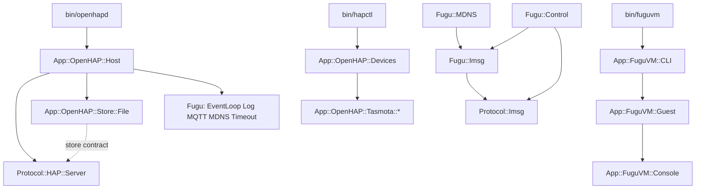

# CPAN namespace realignment — Design

## Problem

The repository claims three top-level namespaces: `OpenHAP`, `FuguLib`, and
`FuguVM`. The PAUSE guidance on module naming permits a top-level name only for
a nexus of modules, or for a fanciful name that names an application. Three
claims for one project fail that test. Two other faults come with them.

`Lib` carries no information. Every Perl module is a library, so the word does
the same empty work as `API` or `Interface`. `OpenHAP` and `FuguVM` are
applications, and PAUSE puts applications under `App::`.

Some module names describe a mechanism instead of a feature. `FuguVM::Expect`
names a CPAN dependency. `FuguVM::VM` repeats its parent. `OpenHAP::Server`
collides with `Protocol::HAP::Server`. `OpenHAP::Storage`,
`Protocol::HAP::Store`, and `FuguLib::Store` use three words for one idea.
`FuguLib::Util` hides three unrelated functions behind a general noun.

`FuguLib::Imsg` mixes two jobs. It encodes and decodes the imsg(3) frame, and it
also owns a socket. The codec is reusable; the socket is not.

`Protocol::HAP` is the one namespace that already follows the guidance. It is
the model for this effort.

The project has no users. A clean break is possible.

## Goals

1. The repository holds five namespaces: `App::OpenHAP`, `App::FuguVM`, `Fugu`,
   `Protocol::HAP`, and `Protocol::Imsg`.
2. The repository claims exactly one top-level name, `Fugu`. It is a nexus of 21
   modules, so the guidance permits it. `App::` and `Protocol::` are shared
   namespaces that the project joins.
3. No module name repeats its parent, and no module name describes a dependency
   instead of a feature.
4. `Protocol::Imsg` is a sans-IO codec. `Fugu::Imsg` owns the socket and uses
   the codec.
5. Behavior does not change, with one exception: `hapctl` prints a device class,
   so its output and its manual change with the package names.

The products keep their names. The daemon is still OpenHAP, the command is still
`openhapd`, and the VM utility is still FuguVM. The one exception is FuguLib:
the collection itself is now called Fugu, so prose that names the collection
changes with the packages.

## Non-goals

- No CPAN release. No `$VERSION`, no `Makefile.PL`, no distribution main
  modules, and no `no_index` metadata. `TODO.md` records that work.
- No move of `Fugu::MQTT`, `Fugu::MDNS`, `Fugu::SSH`, or `Fugu::Proxy` into
  `Net::` or `HTTP::`. `TODO.md` records the question. `Fugu::MDNS` needs a
  second question first: it publishes through `mdnsd(8)`, so the name promises a
  protocol implementation that the module does not hold.
- No rename of `Protocol::HAP::PIN` to `SetupCode`. The pod already gives the
  specification word, and the rename would churn the conformance suite.
- No new features and no API changes, except the two that a rename forces: the
  split of `FuguLib::Util` and the split of `FuguLib::Imsg`.

## Accepted trade-offs

Three choices in this design have a real argument against them. Take them
knowingly.

1. **`App::` holds no command implementations.** `bin/openhapd` and `bin/hapctl`
   hold the command logic, so `App::OpenHAP::` holds libraries only. The
   counter-precedent is `Mail::SpamAssassin`: an OS-packaged daemon that keeps
   its modules in a domain namespace. Accept `App::` because both products are
   applications first, and a domain namespace would be a second top-level claim.
2. **imsg is not an interoperable wire protocol.** The header is native-endian
   and never crosses a host, while `Protocol::` on CPAN holds interoperable
   protocols. `OpenBSD::` is the honest alternative and it is unusable: OpenBSD
   base perl owns that namespace with `OpenBSD::Pledge`, `OpenBSD::Unveil`, and
   the `pkg_add` tree. `Protocol::Imsg` states the limit in its first paragraph.
3. **`Store` still names three things**: a JSON state file (`Fugu::Store`), a
   persistence contract (`Protocol::HAP::Store`), and an implementation of that
   contract (`App::OpenHAP::Store::File`). The last cannot move into
   `Protocol::HAP::Store::File`, because it uses `Fugu::File` and the layering
   rules forbid that direction. Goal 3 does not claim unique leaf names:
   `Proxy`, `Config`, and `CLI` also repeat, each as a subclass of the `Fugu::`
   module with the same leaf name.

## The clean-break rule

This effort is evergreen. An old name and its replacement never exist together.

- Each rename is a `git mv` plus a rewrite. No file stays behind.
- No aliases. No `our @ISA` bridges to an old package. No empty compatibility
  module. No `use lib` trick, and no dual name in `bin/`.
- No deprecation period and no warning. A phase deletes the old name in the same
  commit that adds the new one.
- No upgrade path ships. The repository carries no code and no documentation for
  a machine with an older install.
- The old names survive in exactly one place: `plans/001` to `plans/007`. Those
  files record what was true when they were written. Do not rewrite them.

The rule needs a gate, because nothing in `make check` detects a shim today. A
new `t/scripts/namespaces.t` reads the tracked files with `git ls-files`, skips
`plans/`, and fails on any retired name. Phase 1 creates it; every later phase
appends its retired names. It replaces the hand-run greps, which fail two ways:
`grep -v 'App::OpenHAP::'` drops a whole line, so a stale name hides behind a
live one, and `grep -r` reads the generated pages in `build/` and `web/build/`.

## Target names

### Namespaces

| Now               | Target           | Reason                                |
| ----------------- | ---------------- | ------------------------------------- |
| `OpenHAP::`       | `App::OpenHAP::` | An application belongs under `App::`. |
| `FuguVM::`        | `App::FuguVM::`  | An application belongs under `App::`. |
| `FuguLib::`       | `Fugu::`         | `Lib` says nothing. One nexus stays.  |
| `Protocol::HAP::` | unchanged        | It already follows the guidance.      |
| —                 | `Protocol::Imsg` | A new sans-IO codec.                  |

### Modules that change name

| Now                          | Target                           | Reason                                                      |
| ---------------------------- | -------------------------------- | ----------------------------------------------------------- |
| `OpenHAP::Server`            | `App::OpenHAP::Host`             | It hosts the engine. Two modules must not both be `Server`. |
| `OpenHAP::Storage`           | `App::OpenHAP::Store::File`      | It implements `Protocol::HAP::Store` in a file.             |
| `OpenHAP::DeviceLoader`      | `App::OpenHAP::Devices`          | It holds the devices. `Loader` names the mechanism.         |
| `FuguVM::VM`                 | `App::FuguVM::Guest`             | The name must not repeat the parent.                        |
| `FuguVM::Expect`             | `App::FuguVM::Console`           | It drives the serial console. `Expect` is the dependency.   |
| `FuguLib::Util`              | `Fugu::Timeout`                  | `bounded` and `wait_until` are one idea.                    |
| `FuguLib::Util::format_size` | `App::FuguVM::CLI::_format_size` | The command-line interface is its only caller.              |
| `FuguLib::Imsg`              | `Fugu::Imsg` + `Protocol::Imsg`  | The codec and the socket separate.                          |

`Console`, not `Installer`: the module has two public verbs, `run_install` and
`run_script`, and `fuguvm expect <script>` is a documented subcommand that calls
the second one. `Installer` would name half the module.

Every other module keeps its leaf name.

## Layering

The split of `Imsg` gives `Fugu::` a reason to use `Protocol::`. Three rules
keep the direction clear.

1. `Protocol::*` uses core Perl and the declared CPAN modules only. It never
   uses `Fugu::` or `App::`.
2. `Fugu::*` uses core Perl, its optional CPAN libraries, and the `Protocol::`
   codecs on an allowlist. The allowlist holds `Protocol::Imsg` today. `Fugu::`
   never uses `App::`, and never uses `Protocol::HAP`.
3. `App::*` uses both.

`t/protocol/boundary.t` enforces all three, but not as it stands. Direction two
matches `^(?:Protocol::HAP|OpenHAP)\b` at line 104. After the rename that
pattern matches nothing, so the rule stops being enforced without one test
failing. Phase 2 must widen it to `^App\b`, and phase 4 must add the
`Protocol::` allowlist. The plans call this out because the acceptance greps
cannot see it: the literal text is `OpenHAP)`, with no trailing colons.

## The Imsg contract

`Protocol::Imsg` is pure. It takes bytes and returns bytes.

- Constants: `HEADER_SIZE`, `HEADER_TEMPLATE`, `MAX_IMSGSIZE`, `MAX_PAYLOAD`,
  and `FD_MARK`, as in `spec/MDNS-Imsg.md`.
- `Protocol::Imsg->new` makes a decode buffer.
- `encode(type =>, data =>, peerid =>, pid =>)` returns the framed bytes. It
  returns undef with `$!` set to `EMSGSIZE` for an oversized payload. `pid` uses
  `$args{pid} || $$`, because imsg substitutes the sender's pid when the caller
  passes 0 [MDNS-Imsg §3]. That is the one environment value the codec reads.
- `append($bytes)` adds received bytes to the buffer.
- `next_message` pops one whole message and returns a hashref with `type`,
  `peerid`, `pid`, and `data`. It returns undef when more bytes are necessary.
  An invalid length sets `$!` to `EBADMSG` and makes the failure permanent.
- `is_failed` reports that permanent framing failure.
- `reset` empties the buffer and clears the failure. `Fugu::Imsg::close` needs
  it: it empties the buffer today, so a closed connection can never hand out a
  frame that arrived before the close.

`Fugu::Imsg` keeps `new(fh =>)`, `send`, `recv`, `close`, and `is_dead`, with
the same return values and the same `$!` values. It holds one `Protocol::Imsg`
object and does the write loop, the `SIGPIPE` guard, the `IO::Select` poll, and
the read loop.

The transport must also re-export `MAX_PAYLOAD`. `Fugu::Control` chunks its
replies with `FuguLib::Imsg::MAX_PAYLOAD` as a bareword, so the constant leaving
the module is a compile-time abort, not a runtime error.

## Wiring after the change

## Testing and the build

`t/fugulib/` becomes `t/fugu/`. A tier is named after its product, and only this
product name changes. The rename also reaches 29 test files in the other tiers,
3 of which run only under `make integration`.

Six mechanisms fail quietly under a rename, and no acceptance grep can see any
of them: the `skip_all` guards in `t/fugulib/coreperl.t` and `t/fuguvm/vm.t`,
the path-prefix groups in `web/mkindex.sh`, the `TESTS` variable in
`scripts/integration`, the stale guest install that `scripts/vm-provision`
leaves in `@INC`, the `find … -exec perl -cw {} \;` in `check.yml` that always
exits 0, and the `-d "$script_lib/OpenHAP"` unveil probe in `bin/openhapd`. Each
phase names the ones it touches.

`make check` is `lint test tidy`. It does not run `prettier`, `mandoc -Tlint`,
`install`, or `package`, and `lint` and `tidy` read `lib bin scripts` only.
`t/web/site.t` skips without `lowdown` and `mandoc`, which are `develop`
dependencies. Each phase therefore names the extra commands it must run, and
ends with one `make install DESTDIR=` into an empty directory.

The `Makefile` names every namespace directory in `install`, `uninstall`, and
`package`, and renames each 3p page to `FuguLib::<stem>` in two loops.
`App::FuguVM` joins none of them: FuguVM is a development tool and is not
installed. `uninstall` must never remove a shared parent. It does
`rm -rf $(LIBDIR)/Protocol` today, which deletes every other `Protocol::`
distribution on the machine, and `App/` would be worse.

## Phases

1. `FuguLib::` becomes `Fugu::`. Names only, plus the two gates that later
   phases depend on: `t/scripts/namespaces.t` and the CI compile step.
2. `OpenHAP::` becomes `App::OpenHAP::`, with `Host`, `Store::File`, and
   `Devices`.
3. `FuguVM::` becomes `App::FuguVM::`, with `Guest` and `Console`.
4. `Protocol::Imsg` splits out of `Fugu::Imsg`.
5. `Fugu::Util` splits into `Fugu::Timeout`; the documentation and website pass;
   `TODO.md` records the release work.

The order follows the dependency direction, from the base to the products. Phase
3 depends on phase 2, because both edit the same regex in `t/web/site.t` and in
`t/protocol/boundary.t`, and the phase-2 state must keep `FuguVM` in both. Each
phase lands whole: the modules, their callers, their tests, their manuals, and
the build rules change together.
