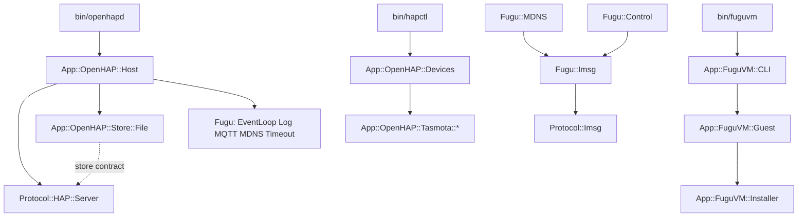

# CPAN namespace realignment — Design

## Problem

The repository claims three top-level namespaces: `OpenHAP`, `FuguLib`, and
`FuguVM`. The PAUSE guidance on module naming permits a top-level name only for
a nexus of modules, or for a fanciful name that names an application. Three
claims for one project fail that test. Two other faults come with them.

`Lib` carries no information. Every Perl module is a library, so the word does
the same empty work as `API` or `Interface`. `OpenHAP` and `FuguVM` are
applications, and PAUSE puts applications under `App::`.

Some module names describe a mechanism instead of a feature. `FuguVM::Expect`
names a CPAN dependency, not the OpenBSD installer that it drives. `FuguVM::VM`
repeats its parent. `OpenHAP::Server` collides with `Protocol::HAP::Server`.
`OpenHAP::Storage`, `Protocol::HAP::Store`, and `FuguLib::Store` use three words
for one idea. `FuguLib::Util` hides three unrelated functions behind a general
noun.

`FuguLib::Imsg` mixes two jobs. It encodes and decodes the imsg(3) frame, and it
also owns a socket. The codec is reusable; the socket is not.

`Protocol::HAP` is the one namespace that already follows the guidance. It is
the model for this effort.

The project has no users. A clean break is possible.

## Goals

1. The repository holds five namespaces: `App::OpenHAP`, `App::FuguVM`, `Fugu`,
   `Protocol::HAP`, and `Protocol::Imsg`.
2. The repository claims exactly one top-level name, `Fugu`. It is a nexus of 20
   modules and a fanciful name, so the guidance permits it. `App::` and
   `Protocol::` are shared namespaces that the project joins.
3. Every module name says what the module does. No name repeats its parent, no
   name describes a dependency, and no two modules in the tree share a leaf name
   for different jobs.
4. `Protocol::Imsg` is a sans-IO codec. `Fugu::Imsg` owns the socket and uses
   the codec.
5. Behavior does not change. The wire formats, the configuration grammar, the
   file paths, the command-line interfaces, and the manual content stay as they
   are.

The products keep their names. The daemon is still OpenHAP, the command is still
`openhapd`, and the VM utility is still FuguVM. Only Perl package names, the
files that hold them, and the manual page names change. The one exception is
FuguLib: the collection itself is now called Fugu, so prose that names the
collection changes with the packages.

## Non-goals

- No CPAN release. No `$VERSION`, no `Makefile.PL`, no distribution main
  modules, and no `no_index` metadata. `TODO.md` records that work.
- No move of `Fugu::MQTT`, `Fugu::MDNS`, `Fugu::SSH`, or `Fugu::Proxy` into
  `Net::` or `HTTP::`. Each needs its own study of the existing module in that
  namespace. `TODO.md` records the question.
- No rename of `Protocol::HAP::PIN` to `SetupCode`. The specification says
  "setup code", but the module name is understood, the pod already gives the
  specification word, and the rename would churn the conformance suite for no
  gain.
- No new features and no API changes, except the two that a rename forces: the
  split of `FuguLib::Util` and the split of `FuguLib::Imsg`.

## The clean-break rule

This effort is evergreen. An old name and its replacement never exist together.

- Each rename is a `git mv` plus a rewrite. No file stays behind.
- No aliases. No `our @ISA` bridges to an old package. No empty compatibility
  module. No `use lib` trick, and no dual name in `bin/`.
- No deprecation period and no warning. A phase deletes the old name in the same
  commit that adds the new one.
- No upgrade path ships. The project has no users. The repository carries no
  code and no documentation for a machine with an older install.
- The old names survive in exactly one place: `plans/001` to `plans/007`. Those
  files record what was true when they were written. Do not rewrite them.
- The acceptance greps in each phase define completeness. A phase is done when
  its grep finds nothing outside `plans/`.

## Target names

### Namespaces

| Now               | Target           | Reason                                |
| ----------------- | ---------------- | ------------------------------------- |
| `OpenHAP::`       | `App::OpenHAP::` | An application belongs under `App::`. |
| `FuguVM::`        | `App::FuguVM::`  | An application belongs under `App::`. |
| `FuguLib::`       | `Fugu::`         | `Lib` says nothing. One nexus stays.  |
| `Protocol::HAP::` | unchanged        | It already follows the guidance.      |
| —                 | `Protocol::Imsg` | A new sans-IO codec.                  |

### Modules that change name

| Now                          | Target                           | Reason                                                                                      |
| ---------------------------- | -------------------------------- | ------------------------------------------------------------------------------------------- |
| `OpenHAP::Server`            | `App::OpenHAP::Host`             | It hosts the engine. Two modules must not both be `Server`.                                 |
| `OpenHAP::Storage`           | `App::OpenHAP::Store::File`      | It implements the `Protocol::HAP::Store` contract in a file. It pairs with `Store::Memory`. |
| `OpenHAP::DeviceLoader`      | `App::OpenHAP::Devices`          | It holds the devices. `Loader` names the mechanism.                                         |
| `FuguVM::VM`                 | `App::FuguVM::Guest`             | The name must not repeat the parent.                                                        |
| `FuguVM::Expect`             | `App::FuguVM::Installer`         | It drives the OpenBSD installer. `Expect` is the dependency.                                |
| `FuguLib::Util`              | `Fugu::Timeout`                  | `bounded` and `wait_until` are one idea.                                                    |
| `FuguLib::Util::format_size` | `App::FuguVM::CLI::_format_size` | The command-line interface is its only caller.                                              |
| `FuguLib::Imsg`              | `Fugu::Imsg` + `Protocol::Imsg`  | The codec and the socket separate.                                                          |

Every other module keeps its leaf name: `Tasmota::*`, `Test::Integration`,
`Disk`, `Image`, `ImageCache`, `QMP`, `QGA`, `State`, `Config`, `Proxy`, `CLI`,
and the 19 other `Fugu::` modules.

## Layering

The split of `Imsg` gives `Fugu::` a reason to use `Protocol::`. Three rules
keep the direction clear. `t/protocol/boundary.t` enforces all three.

1. `Protocol::*` uses core Perl and the declared CPAN modules only. It never
   uses `Fugu::` or `App::`.
2. `Fugu::*` uses core Perl, its optional CPAN libraries, and the `Protocol::`
   codecs on an allowlist. The allowlist holds `Protocol::Imsg` today. `Fugu::`
   never uses `App::`, and never uses `Protocol::HAP`: a generic daemon toolkit
   has no business in HomeKit.
3. `App::*` uses both.

## The Imsg contract

`Protocol::Imsg` is pure. It takes bytes and returns bytes.

- Constants: `HEADER_SIZE`, `HEADER_TEMPLATE`, `MAX_IMSGSIZE`, `MAX_PAYLOAD`,
  and `FD_MARK`, as in `spec/MDNS-Imsg.md`.
- `Protocol::Imsg->new` makes a decode buffer.
- `encode(type =>, data =>, peerid =>, pid =>)` returns the framed bytes. It
  returns undef with `$!` set to `EMSGSIZE` for an oversized payload. `pid`
  defaults to `$$`, the one environment value that the codec reads.
- `append($bytes)` adds received bytes to the buffer.
- `next_message` pops one whole message and returns a hashref with `type`,
  `peerid`, `pid`, and `data`. It returns undef when more bytes are necessary.
  An invalid length sets `$!` to `EBADMSG` and makes the failure permanent.
- `is_failed` reports that permanent framing failure.

`Fugu::Imsg` keeps its current public API: `new(fh =>)`, `send`, `recv`,
`close`, and `is_dead`. It holds a `Protocol::Imsg` object, does the write loop,
the `SIGPIPE` guard, the `IO::Select` poll, and the read loop. The callers —
`Fugu::Control`, `Fugu::MDNS`, and the tests — change the module name and
nothing else.

## Wiring after the change

## Testing

- `t/fugulib/` becomes `t/fugu/`. A tier is named after its product, and only
  this product name changes. `t/openhap/` and `t/fuguvm/` keep their names.
- `t/lib/FuguLib/TestLog.pm` becomes `t/lib/Fugu/TestLog.pm`.
  `t/lib/OpenHAP/TestMock/MQTT.pm` becomes `t/lib/App/OpenHAP/TestMock/MQTT.pm`.
- `t/protocol/imsg.t` covers the codec. `t/fugu/imsg.t` covers the transport
  over a socketpair. `t/conformance/mdns-imsg.t` keeps its name and its
  citations, and drives `Protocol::Imsg` for the framing rules.
- `t/fugu/coreperl.t` must still pass. `Fugu::Imsg` requires `Protocol::Imsg`,
  which is under `lib/` and uses core Perl only.
- `t/web/site.t` holds the directory name `fugulib` and a
  `^(?:OpenHAP|FuguVM|Protocol)::` match. Both change.
- Each phase ends with `make check` green and `make spec-coverage` clean.

## Build, install, and CI

- The `Makefile` names every namespace directory in `install`, `uninstall`, and
  `package`. All three change. `App::FuguVM` does not join them: FuguVM is a
  development tool and is not installed.
- The `install-man` and `web` targets rename each 3p page to `FuguLib::<stem>`.
  The prefix becomes `Fugu::`. `MAN3P` and the `.Xr` cross-references follow.
- `scripts/integration` carries `t/fugulib/sandbox.t` and `lib/OpenHAP/Test/`
  into the guest, and copies the second to `site_perl/OpenHAP/`. All three paths
  change.
- The path filters in `.github/workflows/integration.yml` name `lib/FuguLib/`,
  `lib/OpenHAP/`, `lib/FuguVM/`, and `t/fugulib/sandbox.t`, in the push list and
  the pull-request list. `check.yml` matches `lib/**.pm` and needs no change.

## Phases

1. `FuguLib::` becomes `Fugu::`. Names only, no behavior change.
2. `OpenHAP::` becomes `App::OpenHAP::`, with `Host`, `Store::File`, and
   `Devices`.
3. `FuguVM::` becomes `App::FuguVM::`, with `Guest` and `Installer`.
4. `Protocol::Imsg` splits out of `Fugu::Imsg`.
5. `Fugu::Util` splits into `Fugu::Timeout`; the documentation and website pass;
   `TODO.md` records the release work.

The order follows the dependency direction, from the base to the products. Each
phase lands whole: the modules, their callers, their tests, their manuals, and
the build rules change together.
