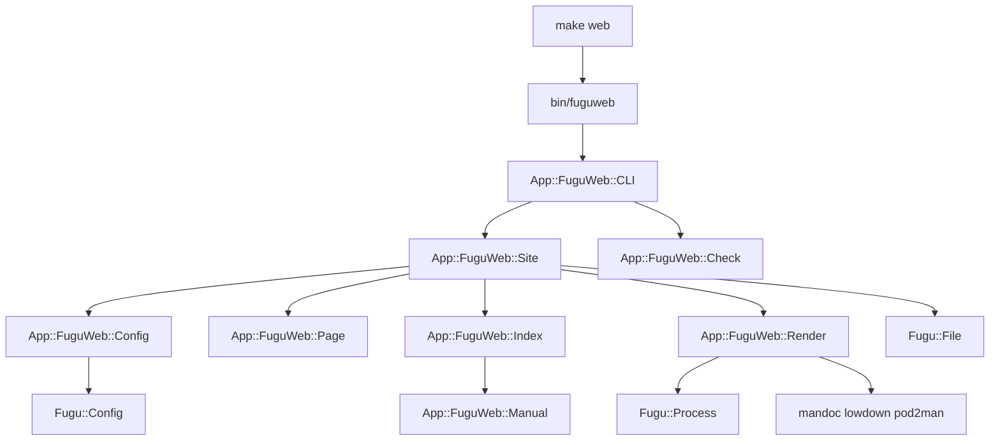

# App::FuguWeb extraction — Design

## Problem

`make web` builds the website from two `sh` scripts and a 60-line recipe. The
recipe holds the project knowledge, not the tooling: the page list, the page
titles, the four named mdoc pages, the manual-namespace prefix rule, the
`pod2man` options, and the asset list. `web/mkindex.sh` holds a six-row group
table in its own body. `web/head.html` holds the site name, the banner, and the
navigation.

No other project can reuse this. A second project must copy both scripts, copy
the recipe, and then edit both copies. The same facts also exist four times: in
the `Makefile` recipe, in `web/head.html`, in `@SITE` and `@NAV` in
`t/web/site.t`, and in the path filter of `.github/workflows/web.yml`.

Plan 008 measures the cost from the other side. It lists `web/mkindex.sh` among
the six mechanisms that fail quietly under a rename, and four of its five phases
must edit the same three web files by hand. Every project that copies this
tooling inherits that tax.

We plan to maintain more projects like OpenHAP. The tooling must become a Perl
application that a project installs and configures.

## Relation to plan 008

**This effort starts after plan 008 lands.** Plan 008 renames every namespace,
so this design names the results and not the current tree: `Fugu::` for every
library the tool uses, `lib/App/OpenHAP/`, `lib/App/FuguVM/` and `lib/Protocol/`
for the module groups, `man/fugu/` with the `Fugu::` staging prefix, and
`fugu.html` in the navigation. It also extends two things plan 008 builds:
`t/scripts/namespaces.t` and the layering rules.

The dependency runs one way. Plan 008 does not need this effort. This effort
cannot start before it, because every path and every package name would be
wrong.

Plan 008 also settles the naming question. PAUSE puts an application under
`App::`, and `fuguweb` is an application. `App::FuguWeb` completes the trio and
claims no new top-level name.

## Goals

1. `App::FuguWeb` builds a static documentation site for any Perl project that
   uses mdoc(7) manuals, POD sidecars, and Markdown.
2. `web/` holds content only: `*.body.html`, `robots.txt`, and `CNAME`.
3. The `web` and `web-clean` targets run one command each.
4. One file, `.fuguwebrc`, describes the site.
5. The rendered site does not change. Every phase leaves the output
   byte-identical to the reference build.
6. The generic site checks become part of the tool, so every project gets them.

## Non-goals

- No CPAN release. PAUSE registration, `$VERSION` policy, and distribution
  tooling are release work, recorded in `TODO.md`.
- No new site features, and no change to the look of the site.
- No `fuguweb.html` project page, and no seventh navigation item. The tool
  reaches the site through `manuals.html`, like every other manual.
- No replacement of `mandoc` or `lowdown` with Perl code.
- No repository split.

## Architecture

### Modules

New namespace under `lib/App/FuguWeb/`, with `bin/fuguweb` as the driver.
`bin/fuguweb` copies `bin/fuguvm`: it adds `lib/` to `@INC` and calls
`App::FuguWeb::CLI->run(@ARGV)`.

| Module           | Source of the code                       | Function                                                        |
| ---------------- | ---------------------------------------- | --------------------------------------------------------------- |
| **App::FuguWeb** | new                                      | umbrella documentation and the shared escape                    |
| **Config**       | the lists in `Makefile` and `mkindex.sh` | the site description over `Fugu::Config`                        |
| **Page**         | `mkpage.sh`, `head.html`, `foot.html`    | build the chrome and wrap one body fragment                     |
| **Render**       | the `Makefile` pipelines                 | run `mandoc`, `lowdown`, and `pod2man`; probe a missing tool    |
| **Manual**       | `mkindex.sh` name and description code   | one manual source: path, name, section, page, description       |
| **Index**        | `mkindex.sh`                             | build the body of `manuals.html` from the grouped manuals       |
| **Site**         | the `web` target                         | probe, lint, stage, render, copy the assets, remove the staging |
| **Check**        | the generic half of `t/web/site.t`       | check links, fragments, reachability, and the output inventory  |
| **CLI**          | new                                      | subcommand dispatch over `Fugu::CLI`                            |

### Layering

Plan 008 states three rules: `Protocol::*` uses core Perl only, `Fugu::*` adds
the `Protocol::` codecs on an allowlist, and `App::*` uses both. `App::FuguWeb`
sits in the third group and adds one rule of its own:

> A sibling application is not a library. `App::FuguWeb` never uses
> `App::OpenHAP` or `App::FuguVM`, and neither uses `App::FuguWeb`.

`t/fuguweb/boundary.t` enforces that rule in both directions.
`t/protocol/boundary.t` keeps the three rules above; its `^App\b` pattern
already covers the new namespace, so it needs no change.

The tool uses `Fugu::CLI` for dispatch and the generic exit codes,
`Fugu::Config` for the grammar and `find_project_root`, `Fugu::File` for reads,
writes and `share_path`, `Fugu::Process` for the renderers, and `Fugu::Log` for
diagnostics. The external tools stay external: `mandoc`, `lowdown`, and core
`pod2man`. `App::FuguWeb` adds no CPAN dependency.

`Fugu::Process->run` gains one option, `cwd`. `mandoc` resolves a `.Xr` target
against its working directory, so the staging trick needs a child that starts
somewhere else. A `chdir` in the parent would race every other relative path in
the build. The option is generic, so it belongs in `Fugu`, with its own manual
entry and its own test.

### Subcommands

```
fuguweb build [--out <dir>]     render the whole site
fuguweb clean [--out <dir>]     remove the output directory
fuguweb check [--out <dir>]     check a built site
fuguweb page <title>            wrap a body fragment from standard input
fuguweb index                   write the body of the manual index
fuguweb init                    write a starter .fuguwebrc
```

`page` and `index` exist because a project may want one page out of the set.
`build` calls the same code.

### The configuration file

`.fuguwebrc` sits at the project root, and `Fugu::Config` parses it. The name
and the discovery match `.fuguvmrc`. The grammar is line-based: a block header
ends the line, and each setting takes a line of its own. A value may not hold a
`#`, because the grammar has no escape for a comment.

```
site       = OpenHAP
out_dir    = web/build
source_dir = web
entry      = index.html

nav "fugu.html" {
	label = Fugu
}

page "install.html" {
	title    = Install
	markdown = INSTALL.md
}

manuals "Fugu" {
	dir       = man/fugu
	anchor    = fugu
	namespace = "Fugu::"
}

modules "OpenHAP modules" {
	dir    = lib/App/OpenHAP
	anchor = modules
}
```

A `page` block names one of three sources: `body` for a fragment in
`source_dir`, `markdown` for a Markdown file, or `index = yes` for the generated
manual index. `unlinked = yes` marks a page that no other page links to, such as
`404.html`. The other settings are `banner`, `lang`, `module_root`,
`stylesheet`, `pod_center`, `pod_release`, `mandoc_os`, and `man_url`.

Three rules keep lists out of the file:

- A `manuals` block globs its directory for `*.1`, `*.3p`, `*.5`, and `*.8`. The
  extension gives the section, and `namespace` prefixes the page name and the
  staged file name.
- A `modules` block finds every `*.pod` file below its directory. The name drops
  the `module_root` prefix and maps `/` to `::`. A block must never name
  `lib/App`, because that one directory holds three namespaces.
- Every file in `source_dir` that does not end in `.body.html` is an asset, and
  the build copies it. `robots.txt` and `CNAME` need no entry.

The order of the index must not change, so the sort keys copy what the recipe
produces today. A `manuals` group sorts by section, in the order 1, 3p, 5, 8,
and then by file name in `LC_ALL=C` order. A `modules` group sorts by path in
`LC_ALL=C` order, so `Store.pod` stays before `Store/Memory.pod`. The tool sorts
the entries itself and never reads the locale of the builder.

### The chrome and the theme

`App::FuguWeb::Page` builds the document from the configuration and replaces the
`sed` substitution, so a title may hold any character. The layout does not
change. Two separators are not ASCII: an em dash between the title and the site
name, and a middle dot between navigation entries. The module defines them as
byte constants, because no file carries `use utf8` and `Fugu::File` reads and
writes bytes.

The footer text is project prose, so it stays content, in an optional
`web/footer.body.html` fragment. `App::FuguWeb::Index` likewise puts an optional
`web/manuals.body.html` fragment before the generated list.

The tool ships the base stylesheet at `share/fuguweb/style.css`, found by
`Fugu::File->share_path`. This is the current `web/style.css`, unchanged: both
of its halves are project-neutral, the openbsd.org typography and the mandoc and
`pod2man` class rules. A project may add `web/extra.css`; the asset rule copies
it and `Page` links it after the base sheet.

`share_path` resolves two levels above `lib/Fugu/File.pm` and then falls back to
the working directory. That finds the sheet in a checkout, which is where
`fuguweb` runs, as `fuguvm` does. It does not find the sheet from an installed
CPAN distribution, where the data would sit under a `File::ShareDir` path.
`TODO.md` records that with the other release work, and the `stylesheet` setting
overrides the search, so a project is never blocked by it.

### Facts that must survive the move

`web/CLAUDE.md` records five findings, and each becomes a comment beside the
code that depends on it. Two of them shape the design and not only a comment:

1. `mandoc` picks a local or a remote `.Xr` target by looking for a file named
   `%N.%S` in its working directory. That is why `Site` stages every mdoc source
   in one directory, under its namespaced name, and why `Render` needs `cwd`.
2. The build must not vary with the machine. `mandoc -I os=` pins the footer,
   and `pod2man --date` gets the date of the last commit, because git does not
   preserve file times.

The other three are the `./` prefix on every local link, the `L<Module>` links
that `pod2man` drops, and the named failure for a missing renderer.
`mandoc -Tlint -W warning` over every mdoc source moves into `fuguweb build`.

### The Makefile after the change

```make
FUGUWEB		?= bin/fuguweb

web:
	@$(FUGUWEB) build --out $(WEBOUT)

web-clean:
	@$(FUGUWEB) clean --out $(WEBOUT)
```

`LOWDOWN`, `POD2MAN`, `MKPAGE`, `MKINDEX`, `WEBMAN`, `FINDPOD`, and `MANHTML`
all go. `MANDOC` stays only if the `%.cat*` rules of the `man` target still need
it. `WEBOUT` stays: `t/web/site.t` and `.github/workflows/web.yml` both set it.

`MAN1`, `MAN3P`, `MAN5`, and `MAN8` stay, because `install-man`, `package`,
`uninstall`, and `man` still read them. The site no longer reads them, because a
`manuals` block globs its directory instead. `fuguweb` is a development tool, so
it joins `install`, `uninstall`, and `package` no more than `fuguvm` does.

### Wiring after the change



## Rules

- No package-level mutable state. Two sites in one process must not share state.
- The build reads nothing from the network, writes nothing outside the output
  directory, and gives the same bytes for the same checkout.
- Documentation follows the root `CLAUDE.md` table: every `App::FuguWeb` module
  gets a `.pod` sidecar, and `fuguweb` gets `man/fuguweb/fuguweb.1`. Only
  `Fugu::` uses 3p pages.
- The clean-break rule of plan 008 holds here. A deleted script never returns
  under another name, and `t/scripts/namespaces.t` gains the retired file names.

## Testing

- New module tier `t/fuguweb/`, with the same rules as `t/fuguvm/`. A tier is
  named after its product, so the `App::` prefix does not reach the directory
  name. The `Makefile` test target and the tier table in `t/CLAUDE.md` gain the
  entry.
- The module tests build their sources in a `File::Temp` directory. They do not
  read the repository, so a change under `man/` or `lib/` cannot break them.
- `t/web/site.t` keeps its tooling-tier rule. It drives subprocesses:
  `make web`, then `bin/fuguweb check`. It keeps only the OpenHAP-specific
  assertions.
- Take the reference build from the tip of the default branch, after plan 008
  lands. Every phase then ends with a byte-for-byte comparison against it.
- Each phase proves its failure mode once by hand before the commit.

## Phases

1. Page assembler: `App::FuguWeb`, `Config`, `Page`, `CLI`, `bin/fuguweb`, and
   `.fuguwebrc`. `mkpage.sh`, `head.html`, and `foot.html` die.
2. Manual index: `Manual` and `Index`. The group table moves into `.fuguwebrc`.
   `mkindex.sh` dies, and `web/` holds no script.
3. Whole build: `Render`, `Site`, and `cwd` in `Fugu::Process`. The stylesheet
   moves to `share/fuguweb/`. The `web` target drops to one command.
4. Checks and documentation: `Check`, the shrunk `t/web/site.t`,
   `man/fuguweb/fuguweb.1`, and every affected `CLAUDE.md`, workflow, and
   manifest.

Each phase lands whole: the module, its callers, its tests, and its
documentation change together, and `make check` passes at the end of each.
