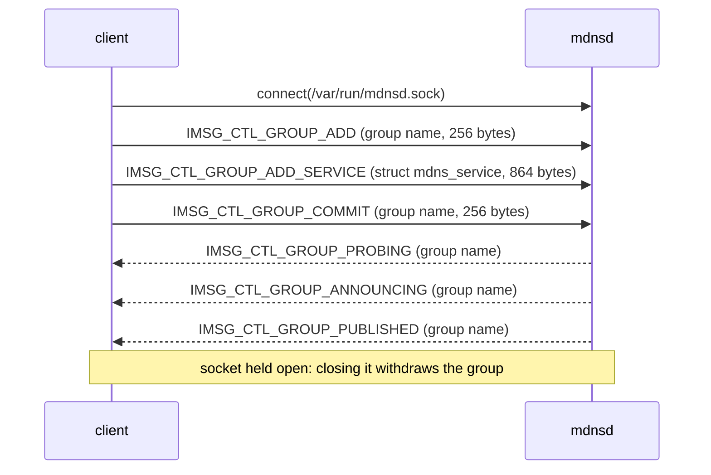

# OpenBSD mdnsd Control Protocol

This document is the entry point to the OpenBSD mdnsd control protocol
reference: the private wire protocol a client speaks over `/var/run/mdnsd.sock`
to publish (and browse, resolve, look up) mDNS services through `mdnsd(8)` from
the `net/openmdns` port. OpenHAP uses it to advertise the `_hap._tcp` service
natively, with no `mdnsctl(8)` child process. Detailed protocol information
lives in the `MDNS-*.md` topic files indexed below.

**Source References:** Information in these documents is derived from the
openmdns sources as installed by the OpenBSD port (`mdnsd/mdns.h`,
`mdnsd/control.c`, `mdnsd/mdns.c`, `mdnsd/packet.c`, `mdnsctl/mdnsl.c`,
`mdnsctl/mdnsctl.c`, `mdnsctl/parser.c`) and from the base-system imsg
implementation (`/usr/include/imsg.h`, `lib/libutil/imsg.c`).

**Provenance:** First derived 2026-07-29 from the sources below and curated by
hand since. Individual claims cite the source file and line they came from.

- Upstream: `haesbaert/mdnsd` git tag `0.7`. The OpenBSD 7.8 port `net/openmdns`
  builds `openmdns-0.7p3` from that tag plus five port patches
  (`patch-mdnsd_control_c`, `patch-mdnsd_control_h`, `patch-mdnsd_mdns_c`,
  `patch-mdnsd_mdnsd_c`, `patch-mdnsd_mdnsd_h` at ports tag `OPENBSD_7_8`). The
  patches fix `-fno-common` duplicate definitions and rename imsg calls to the
  reworked libutil API (`imsg_init` → `imsgbuf_init`, `imsg_read` →
  `imsgbuf_read`, ...); none changes the wire protocol. The installed port is
  authoritative; upstream tag `0.9` (the current port in -current) leaves every
  protocol-relevant file identical to `0.7`.
- imsg framing: `src/lib/libutil/imsg.h` rev 1.24 and `imsg.c` rev 1.42, both at
  tag `OPENBSD_7_8` — the post-2024-rework header. See
  [MDNS-Imsg.md](MDNS-Imsg.md).
- Struct layouts are LP64, verified with a compiled `offsetof`/`sizeof` probe of
  the header's declarations (x86_64; identical layout rules apply on OpenBSD
  aarch64 and amd64, the LP64 targets this repo deploys to). They have not yet
  been re-measured with a probe compiled against the installed
  `/usr/local/include/mdns.h` inside an OpenBSD guest; a claim below that
  depends on runtime behaviour rather than source reading is marked _derived,
  not measured_ where it appears.

---

## Glossary

**imsg** : The base-system framed-message facility (`imsg_init(3)`) used over
local stream sockets. Every control-protocol message is one imsg: a 16-byte
native-endian header followed by a payload. See [MDNS-Imsg.md](MDNS-Imsg.md).

**control socket** : `/var/run/mdnsd.sock`, the `AF_UNIX` stream socket mdnsd
listens on (`mdnsd/mdns.h:37`). Mode 0660, owned by the daemon's user and group
— root and wheel under the stock rc script.

**group** : mdnsd's unit of publication. A client adds a group, adds services to
it, then commits it; mdnsd tracks the group per control connection and tears it
down when that connection closes (`mdnsd/control.c:604-632`).

**service** : One advertised service instance — a `struct mdns_service` carrying
app, proto, instance name, target host, port and TXT data
(`mdnsd/mdns.h:89-100`). mdnsd expands it into PTR, SRV and TXT records
(`mdnsd/mdns.c:718-743`).

**probing** : The first phase after a commit: mdnsd sends three probe queries
250 ms apart to detect name conflicts before claiming the records
(`mdnsd/mdns.c:858-901`).

**announcing** : The second phase: three unsolicited responses at increasing
intervals that put the records in neighbours' caches (`mdnsd/mdns.c:903-937`).

**published** : The terminal state: every entry of the group survived probing
and announcing, and mdnsd notifies the controller (`mdnsd/mdns.c:939-947`).

**collision** : A probe or an incoming packet claimed a name this group wants;
mdnsd reports `IMSG_CTL_GROUP_ERR_COLLISION` and kills the group
(`mdnsd/mdns.c:1227`, `mdnsd/control.c:460-466`).

---

## The publish flow

The group name must equal the service instance name, the reply sequence takes
about four seconds, and the advertisement lives exactly as long as the
connection — all specified in [MDNS-Control.md](MDNS-Control.md), which also
records the error replies and the (non-)semantics of `IMSG_CTL_GROUP_RESET`.

## Topic files

- [MDNS-Imsg.md](MDNS-Imsg.md) — the framing layer: header layout, length
  semantics, message boundaries, the fd-passing facility and why OpenHAP does
  not use it.
- [MDNS-Control.md](MDNS-Control.md) — the control protocol: socket, message
  types and payloads, the `struct mdns_service` ABI, TXT encoding, the group
  state machine and its replies, TXT replacement, and the browse, resolve and
  lookup message shapes.
